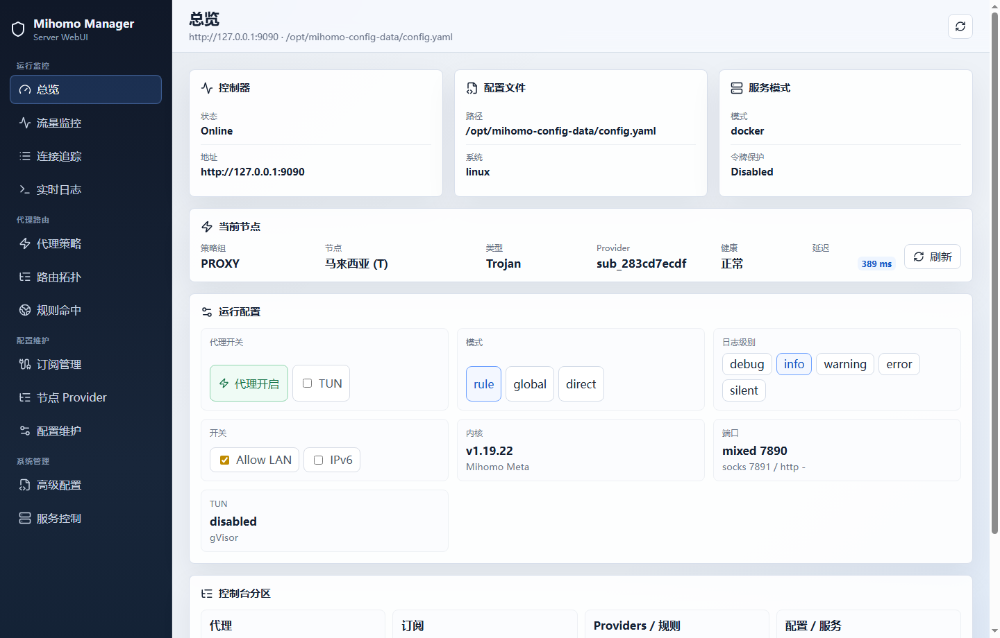
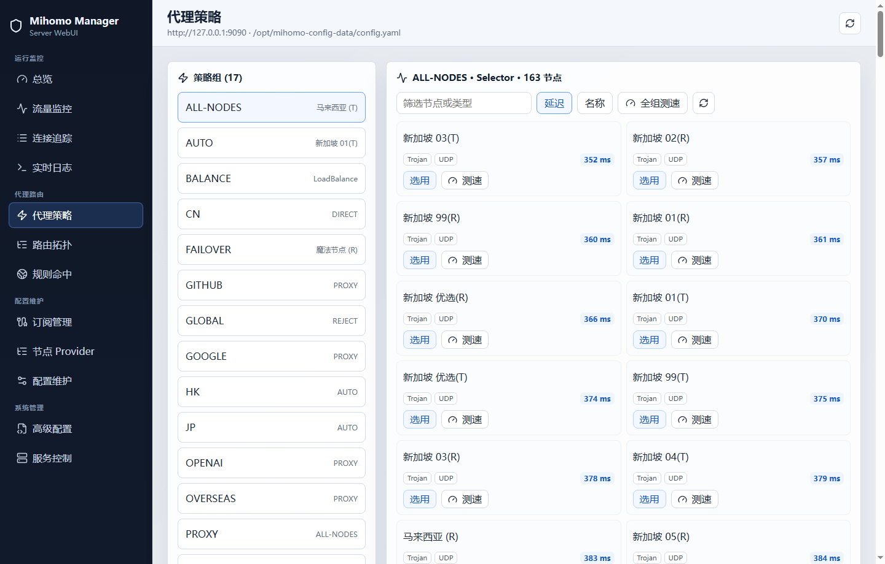

# Mihomo Web Manager

Mihomo Web Manager is a Linux server WebUI for managing a local `mihomo` core from one browser console. It is designed to feel closer to Clash Verge / Zashboard / MetaCubeXD than a plain API wrapper: runtime control, subscription management, provider diagnostics, config editing, backups, and service control live in one UI.

> Status: early preview. It is usable for testing, but the project is still evolving quickly.

## Features

- Runtime dashboard for mihomo `external-controller`
- Proxy group browsing and node selection
- Per-node and per-group latency tests
- Node cards with type, UDP support, provider source, status, and colored delay ranges
- Subscription center for manager-owned subscriptions
- Manager downloads subscriptions and writes local `file` providers for mihomo
- Reads existing `proxy-providers` from `config.yaml` and reports broken file references
- Proxy provider and rule provider refresh pages
- Config file editor with backup before write
- `reload` through mihomo API
- Service control through either `systemd` or Docker container mode
- Optional bearer-token protection for manager APIs when used behind a reverse proxy

## Screenshots

Full screenshot gallery: [docs/SCREENSHOTS.md](./docs/SCREENSHOTS.md)





## Screens

Current navigation:

- `总览`: controller health, runtime switches, current selected route, config path
- `流量监控`: live upload / download stream
- `连接追踪`: active connections, matched rule, route chain, close controls
- `实时日志`: live log stream with connection state
- `代理策略`: proxy groups, node selection, delay tests
- `路由拓扑`: rule-to-policy relationship overview
- `规则命中`: runtime rules and target distribution
- `订阅管理`: add / edit / update manager-owned subscriptions and provider diagnostics
- `节点 Provider`: loaded proxy providers and provider node health checks
- `配置维护`: structured strategy group, rule, and rule-provider maintenance
- `高级配置`: config editor and backups
- `服务控制`: start / stop / restart / reload

## Architecture

```text
Browser
  |
React WebUI
  |
Go Manager API
  |-- /api/mihomo/*      -> mihomo external-controller
  |-- /api/subscriptions -> manager subscription store
  |-- /api/config        -> mihomo config.yaml
  |-- /api/service       -> systemctl or docker
```

The manager intentionally runs on the server because a browser cannot safely read `/etc/mihomo/config.yaml`, write provider files, create backups, or control system services.

## Requirements

- Linux server
- `mihomo` with `external-controller` enabled
- Go 1.24+
- Node.js 20+
- For service control:
  - `systemd`, or
  - Docker with access to the mihomo container

Example mihomo config:

```yaml
external-controller: 127.0.0.1:9090
secret: "your-mihomo-secret"
```

Do not expose the mihomo controller directly to the public Internet.

## Quick Start

```bash
git clone https://github.com/your-name/mihomo-web-manager.git
cd mihomo-web-manager

cd web
npm ci
npm run build
cd ..

go build -o mihomo-manager ./cmd/mihomo-manager

MWM_TOKEN=change-me \
MIHOMO_SECRET=your-mihomo-secret \
MIHOMO_CONFIG=/etc/mihomo/config.yaml \
./mihomo-manager
```

Open:

```text
http://127.0.0.1:8080
```

The WebUI does not include a built-in password box. If `MWM_TOKEN` is enabled, put the manager behind a reverse proxy that injects the `Authorization` header, or leave `MWM_TOKEN` empty and protect access at the network / reverse-proxy layer.

## Environment Variables

| Variable | Default | Description |
| --- | --- | --- |
| `MWM_LISTEN` | `:8080` | Manager listen address |
| `MWM_TOKEN` | empty | Optional bearer token for manager APIs. The WebUI does not collect this token directly. |
| `MWM_DATA_DIR` | `./data` | Manager data directory |
| `MWM_BACKUP_DIR` | `./backups` | Config backup directory |
| `MWM_WEB_DIR` | `./web/dist` | Built frontend directory |
| `MWM_SERVICE_MODE` | `systemd` | `systemd` or `docker` |
| `MIHOMO_CONTROLLER` | `http://127.0.0.1:9090` | Mihomo external-controller URL |
| `MIHOMO_SECRET` | empty | Mihomo controller secret |
| `MIHOMO_CONFIG` | `/etc/mihomo/config.yaml` | Mihomo config path |
| `MIHOMO_CONTAINER` | `mihomo` | Docker container name when `MWM_SERVICE_MODE=docker` |

## Docker-based mihomo

If mihomo runs in Docker and its config is mounted on the host:

```bash
MWM_SERVICE_MODE=docker \
MIHOMO_CONTAINER=mihomo \
MIHOMO_CONFIG=/path/on/host/config.yaml \
MIHOMO_CONTROLLER=http://127.0.0.1:9090 \
MIHOMO_SECRET=your-mihomo-secret \
MWM_TOKEN=change-me \
./mihomo-manager
```

The manager writes provider files relative to the config file:

```text
<config-dir>/proxy-providers/sub_xxxxxxxxxx.yaml
```

## systemd Deployment

Edit `deploy/mihomo-web-manager.env`, then:

```bash
sudo mkdir -p /opt/mihomo-web-manager
sudo cp mihomo-manager /opt/mihomo-web-manager/
sudo cp -r web/dist /opt/mihomo-web-manager/web-dist
sudo cp deploy/mihomo-web-manager.env /opt/mihomo-web-manager/
sudo cp deploy/mihomo-web-manager.service /etc/systemd/system/
sudo systemctl daemon-reload
sudo systemctl enable --now mihomo-web-manager
```

Logs:

```bash
journalctl -u mihomo-web-manager -f
```

## Development

Backend:

```bash
go test ./...
go run ./cmd/mihomo-manager
```

Frontend:

```bash
cd web
npm ci
npm run dev
```

Build everything:

```bash
cd web && npm ci && npm run build
cd ..
go build -o mihomo-manager ./cmd/mihomo-manager
```

## Security Notes

- Protect the WebUI before exposing it to your LAN. Prefer reverse proxy authentication. If `MWM_TOKEN` is set, the reverse proxy must inject `Authorization: Bearer <token>`.
- Prefer reverse proxy with HTTPS and access control.
- Keep `MIHOMO_CONTROLLER` bound to `127.0.0.1` when possible.
- Backups are stored in `MWM_BACKUP_DIR`; protect that directory.
- The service control API can restart or stop your proxy service. Do not expose it without authentication.

## Roadmap

- Proper login page and session handling
- Config schema validation before save
- Safer config diff before write
- Subscription import from existing updater tools
- Profile management
- sing-box adapter
- Docker image and release workflow

## License

MIT. See [LICENSE](./LICENSE).
