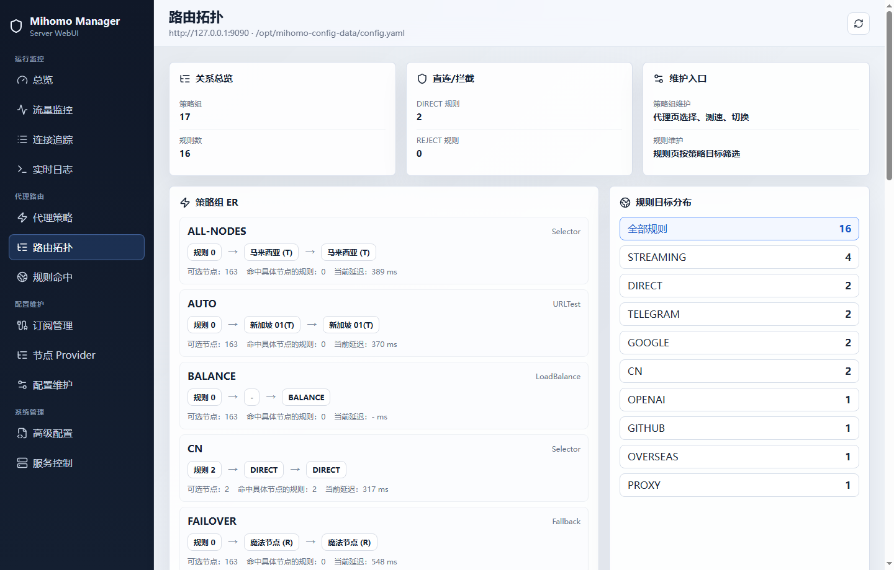
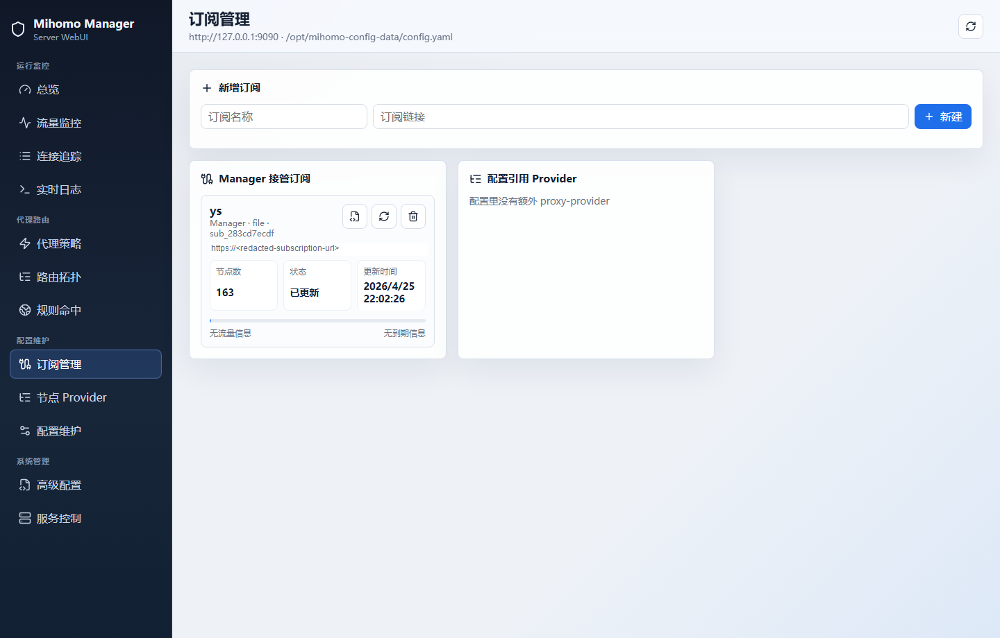
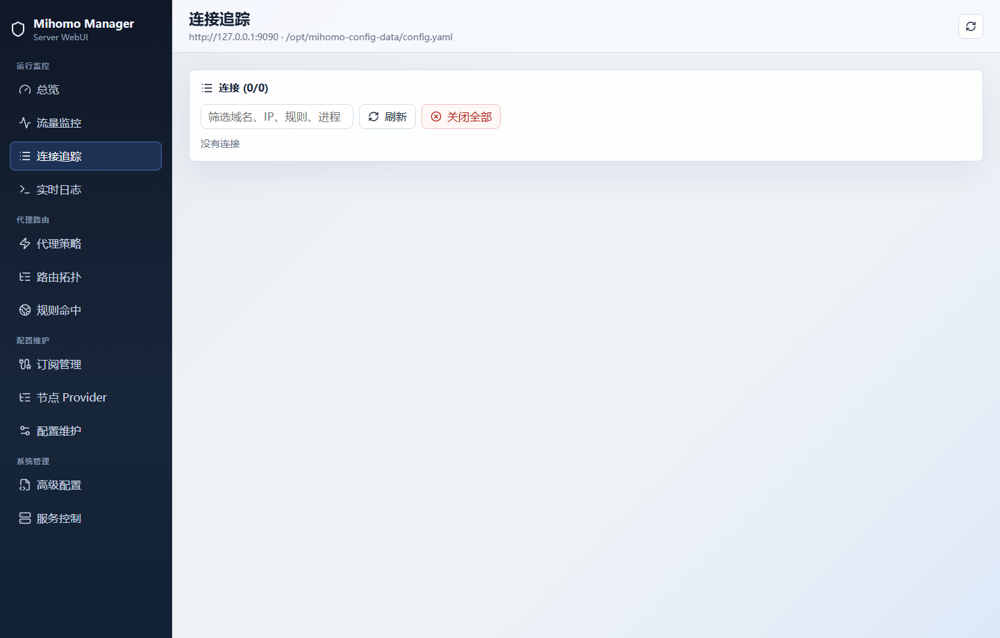
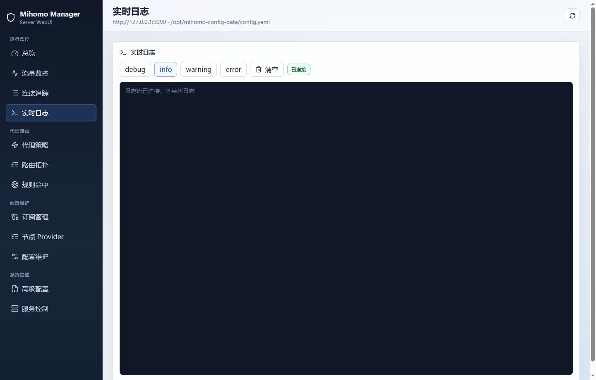
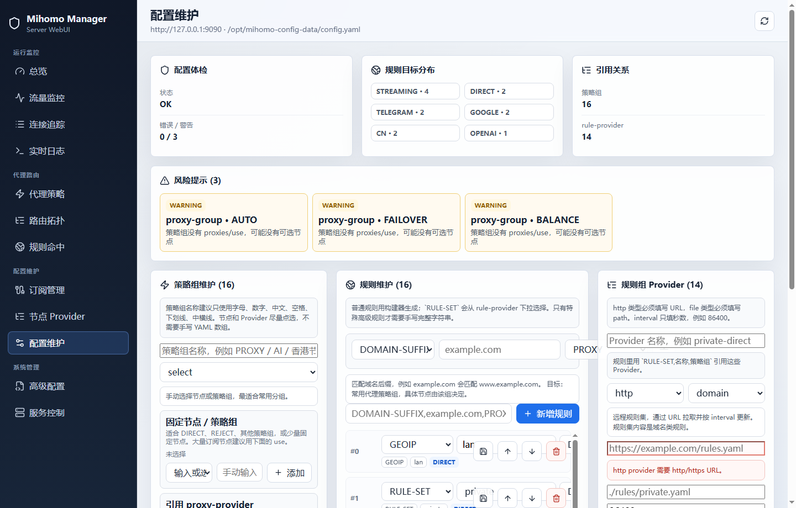

# Screenshots

These screenshots were captured from a live Linux test deployment connected to a running mihomo instance.

## Overview

The overview page shows controller health, active service mode, runtime switches, current selected route, and configuration location.

## Proxy Strategy

Proxy strategy management supports group browsing, node selection, node metadata, status, and latency checks.

## Route Topology

The topology view presents the relationship between runtime rules, target policy groups, and route outcomes.

## Subscription Management

The subscription page displays manager-owned subscriptions, provider diagnostics, update state, node counts, and broken references.

## Connection Tracking

Connection tracking shows active sessions with destination, process, matched rule, proxy chain, traffic, and close controls.

## Real-time Logs

The log page streams mihomo logs through the manager and reports connection state.

## Config Maintenance

Config maintenance provides structured strategy group, rule, and rule provider editing with validation and guided controls.
